---

# 📦 ZipPick\_ver2 — AI 기반 부동산 데이터 분석 & 투자 인사이트 대시보드

> **Streamlit 기반 Full-Stack + AI 프로젝트**
> 전국 부동산 데이터를 수집·분석하여 **이상 매물 탐지, 가격 예측, 텍스트 분석, 투자 리포트 자동화**까지 지원하는 스마트 대시보드입니다.
> **역할:** PM & Full-stack (Python/Streamlit) · 데이터 분석 · AI/ML 모델링

---

## 🎥 시연 영상 & 자료
- 📄 [프로젝트 소개 PDF](./ZipPick_ver2_PDF.pdf)  
- 🎬 [시연 영상 (mp4)](./시연영상.mp4)

---

<p align="center">
  <video
    width="760"
    controls
    autoplay
    muted
    loop
    playsinline>
    <source src="./assets/demo.mp4" type="video/mp4" />
    브라우저가 video 태그를 지원하지 않습니다.
  </video>
</p>


---
## ✨ 무엇을 해결하나요?
복잡한 부동산 데이터를 자동으로 모으고 정리하여 **이상 매물 탐지 · 가격 예측 · 텍스트 분석**을 거쳐  
최종적으로 **투자 인사이트 리포트**까지 자동 생성합니다.

---

### 1) 테크 리포트 (표지)
<div align="center">
  
  <br/><sub><em>프로젝트 발표/개요 문서 표지</em></sub>
</div>

### 2) 프로젝트 목차
<div align="center">
  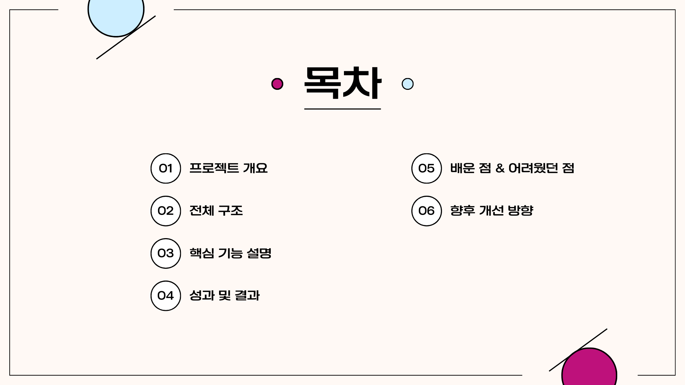
  <br/><sub><em>프로젝트 전반의 흐름을 한 눈에 볼 수 있는 목차</em></sub>
</div>

### 3) 프로젝트 개요
<div align="center">
  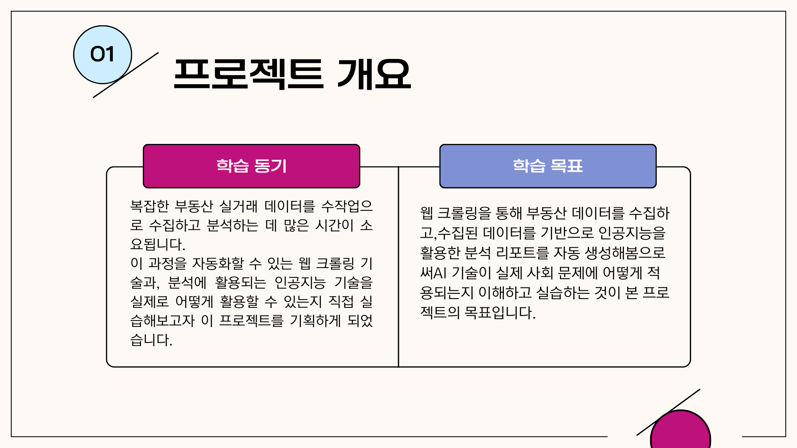
  <br/><sub><em>수집 → 분석 → 리포트까지의 문제 정의와 목표</em></sub>
</div>

---

## 🧱 전체 구조(Architecture)
수집 → 정제 → 분석(ML/LLM) → 대시보드(UI)까지 한 흐름으로 설계했습니다.

### 4) 전체 구조 다이어그램
<div align="center">
  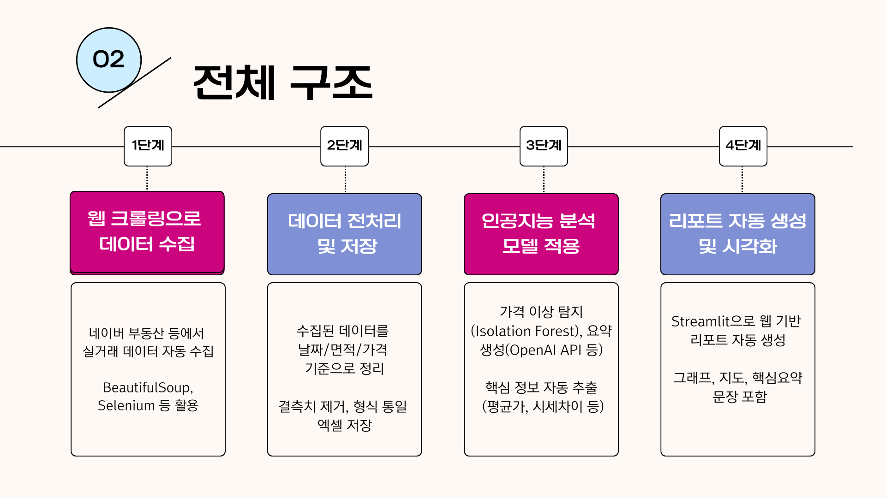
  <br/><sub><em>엔드투엔드 데이터 파이프라인</em></sub>
</div>

### 5) 핵심 기능 설명 (1)
<div align="center">
  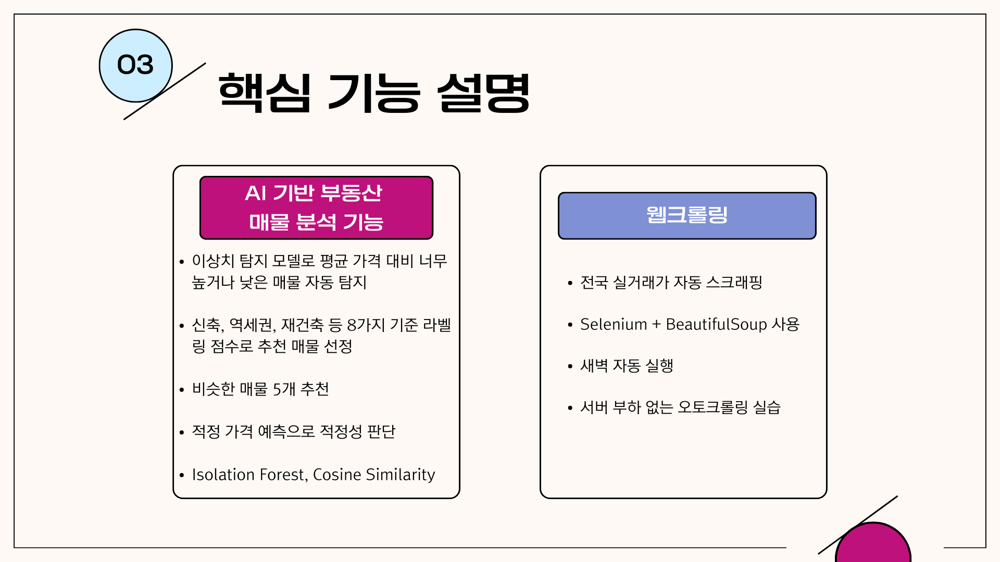
  <br/><sub><em>수집/정제/분석 단계별 주요 기능과 책임</em></sub>
</div>

### 6) 핵심 기능 설명 (2)
<div align="center">
  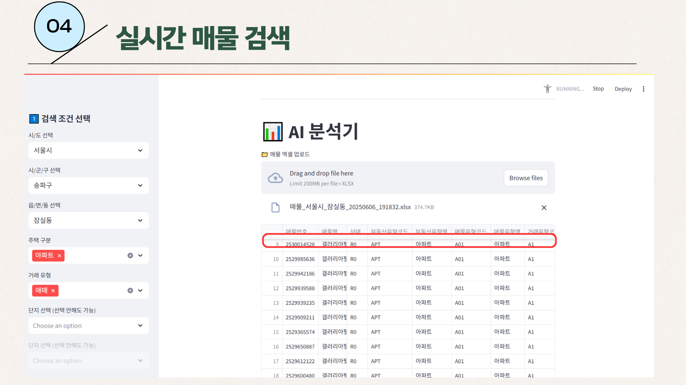
  <br/><sub><em>세부 기능 맵과 사용자 여정</em></sub>
</div>

### 7) 이상 매물 리스트 & AI 적정가격
<div align="center">
  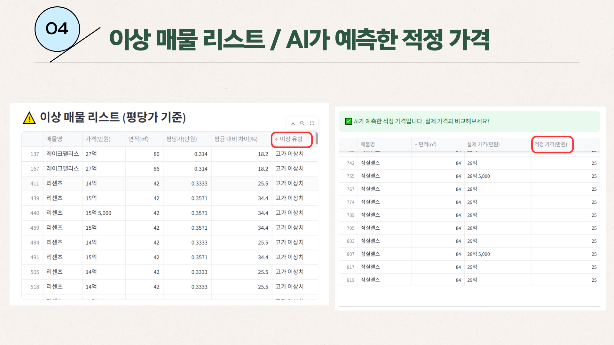
  <br/><sub><em>이상치 탐지 결과와 AI 예측 적정가격 비교</em></sub>
</div>

---

## 🧩 주요 기능

### 8) 빈도수 기반 단어 분석 (BoW)
<div align="center">
  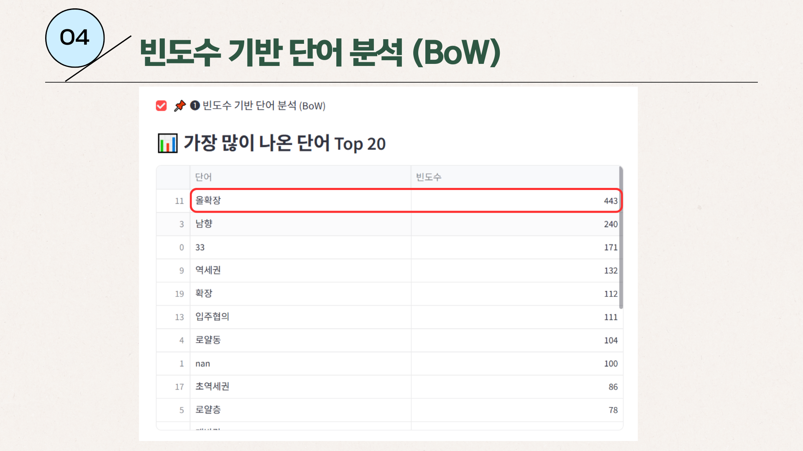
  <br/><sub><em>설명 텍스트에서 자주 등장하는 키워드 Top-N</em></sub>
</div>

### 9) 텍스트 분석 종합 (TF-IDF/라벨링/유사매물)
<div align="center">
  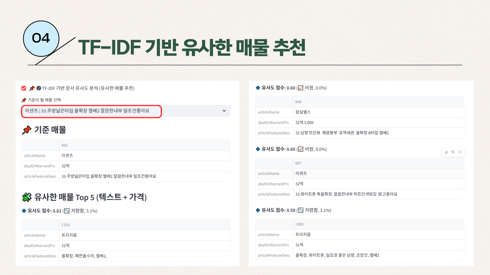
  <br/><sub><em>TF-IDF 기반 유사도와 지도학습 라벨링으로 특징 추출</em></sub>
</div>

### 10) Word2Vec 단어 임베딩 (유사 단어 보기)
<div align="center">
  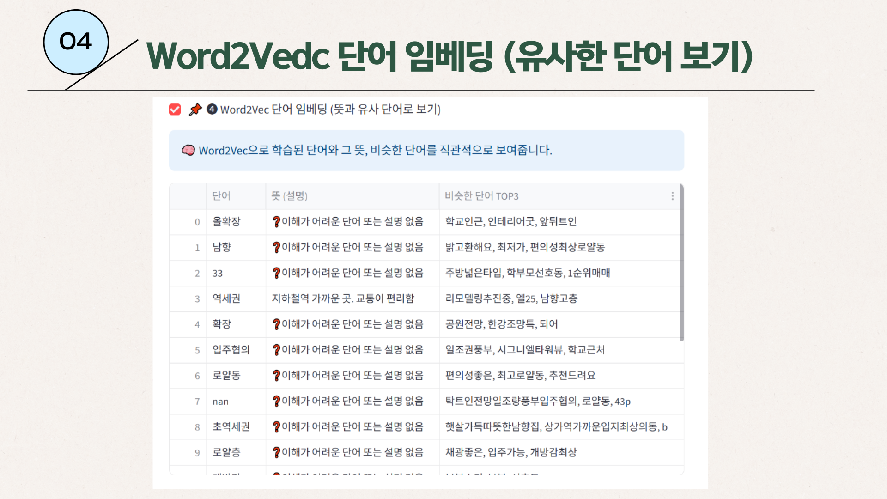
  <br/><sub><em>단어 임베딩을 통해 의미적으로 가까운 단어 탐색</em></sub>
</div>

---

## 📈 투자 가치 분석 & 리포트 자동화

### 11) 토크나이징 & 패딩 (LSTM 입력 전처리)
<div align="center">
  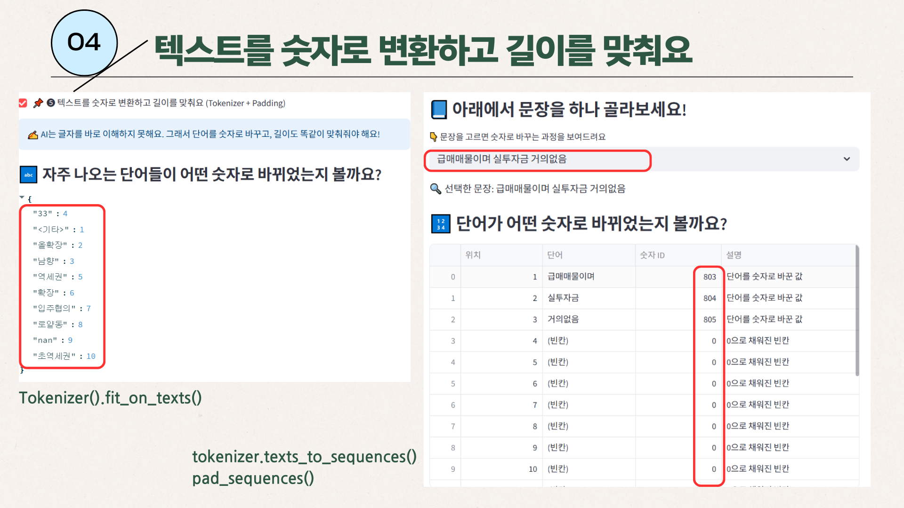
  <br/><sub><em>문장을 정수 시퀀스로 변환하고 길이를 맞춰 모델에 입력</em></sub>
</div>

### 12) AI 추천 상위 매물 (우선순위 높은 순)
<div align="center">
  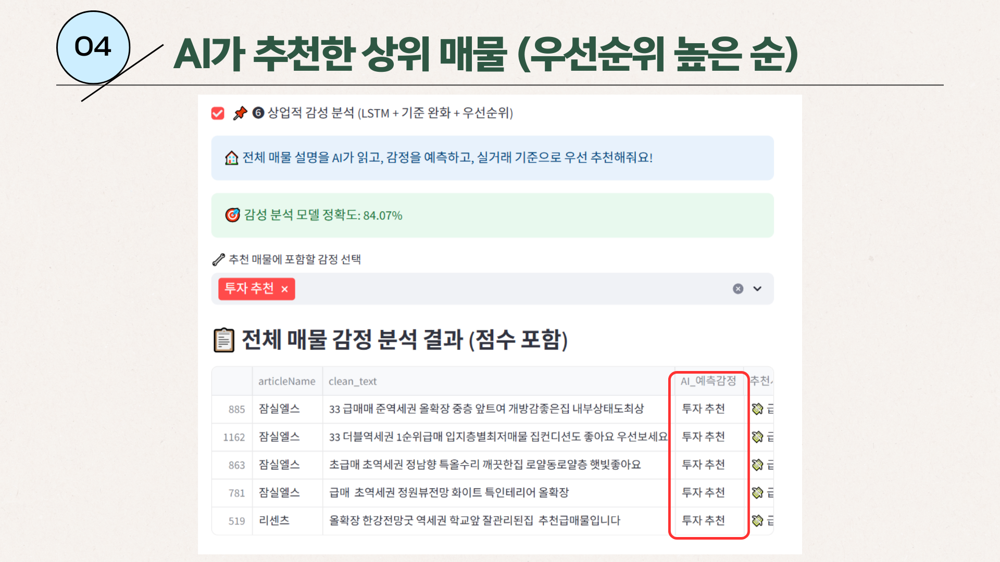
  <br/><sub><em>LSTM 감성분석 + 규칙조합으로 추천 점수 산출</em></sub>
</div>

### 13) 최종 투자 추천
<div align="center">
  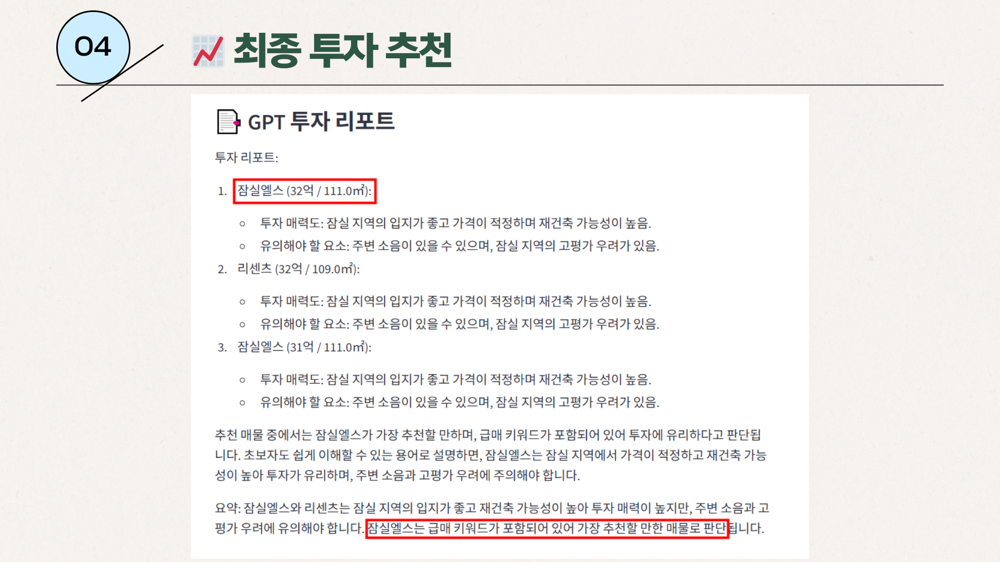
  <br/><sub><em>예측 점수/가격/특징 요약을 종합 반영한 추천 리스트</em></sub>
</div>

### 14) 배운 점 (요약)
<div align="center">
  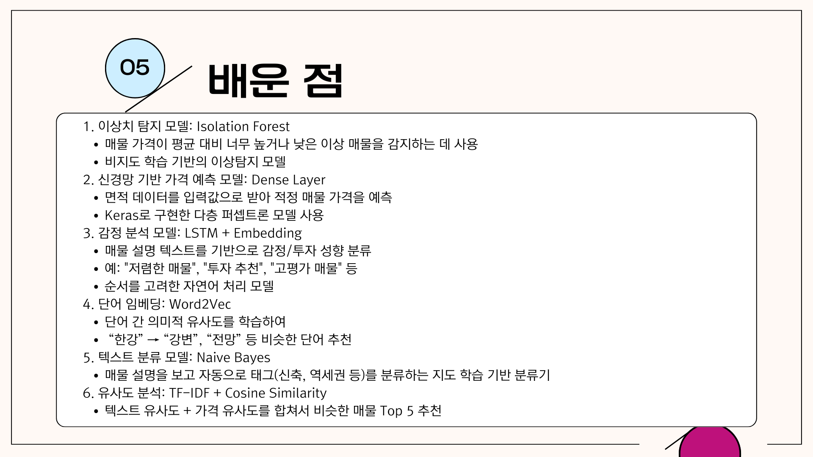
  <br/><sub><em>Isolation Forest, LSTM, Word2Vec 등 핵심 학습 내용</em></sub>
</div>

### 15) 어려웠던 점
<div align="center">
  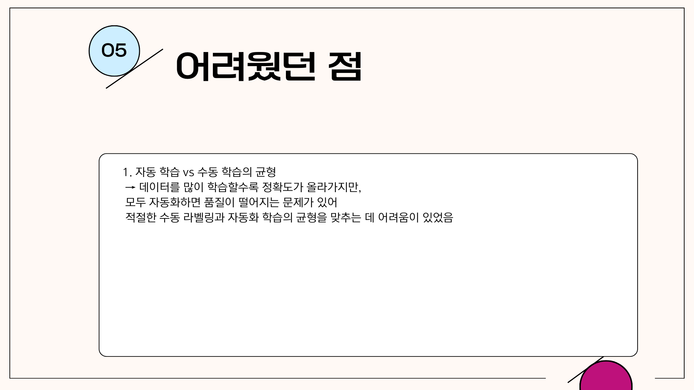
  <br/><sub><em>자동/수동 라벨링의 균형 및 품질 관리 이슈</em></sub>
</div>

### 16) 향후 개선 방향
<div align="center">
  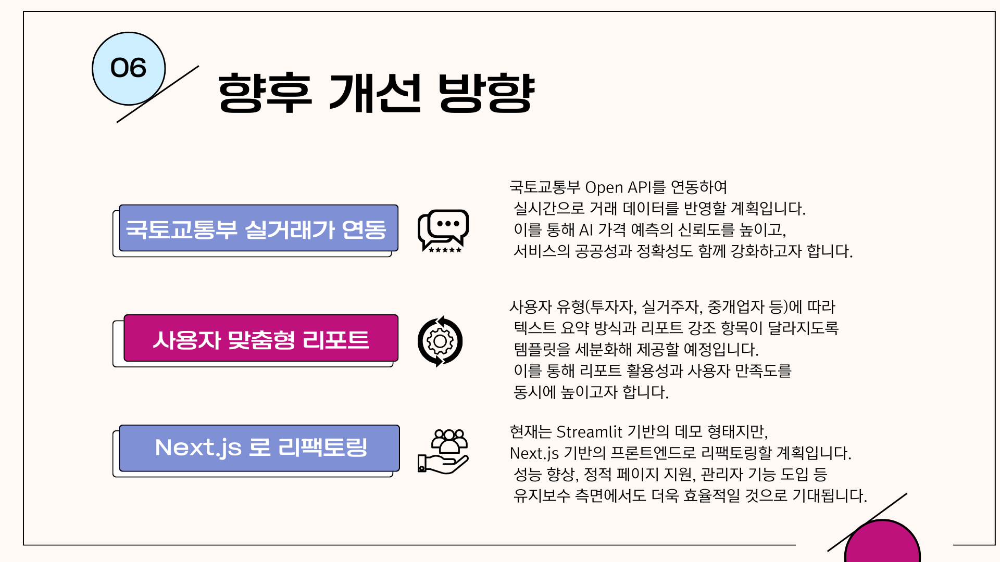
  <br/><sub><em>실거래가 API 연동, 맞춤 리포트 템플릿, Next.js 리팩토링</em></sub>
</div>

### 17) 마무리
<div align="center">
  
  <br/><sub><em>감사합니다</em></sub>
</div>

 
---
## ✨ 핵심 가치 제안 (Why ZipPick?)

* **매물 데이터 자동 수집 & 정리** → 중개사의 수작업 감소
* **AI 기반 이상치 탐지 & 가격 예측** → 비정상 매물 및 적정가 판단
* **텍스트 분석 & 자동 라벨링** → 설명 문구에서 특징(역세권, 신축 등) 자동 태깅
* **투자 가치 리포트 자동화** → GPT API로 투자 인사이트 리포트 생성

---

## 🔧 기술 스택

* **Frontend/UI**: Streamlit
* **Backend & Data**: Python (`pandas`, `numpy`, `requests`)
* **AI/ML**:

  * `scikit-learn`: Isolation Forest, Naive Bayes, TF-IDF, CountVectorizer
  * `TensorFlow/Keras`: MLP 회귀, LSTM 감성 분석
  * `gensim`: Word2Vec 임베딩
* **LLM Integration**: OpenAI GPT (자동 리포트 생성)
* **Infra/Tools**: Docker, `.env` 환경변수 관리, `st.cache_data` 기반 캐싱

---

## 🧩 주요 기능

1. **데이터 수집 & 관리**

   * 지역/단지 단위 매물 조회 및 정리
   * 검색 결과를 Excel(.xlsx)로 저장 & 다운로드

2. **AI 기반 분석**

   * 이상 매물 탐지 (평단가 기준 Isolation Forest)
   * 가격 예측 (면적+가격 → 신경망 회귀 모델)
   * 텍스트 분석 (BoW/TF-IDF, 유사 매물 추천, 자동 라벨링, Word2Vec)

3. **투자 가치 분석**

   * LSTM 감성 분석 → 저평가/고평가/투자 추천 여부 판단
   * GPT API 활용 → 투자 리포트 자동 작성

---

## 📂 프로젝트 구조

```
ZipPick_ver2/
├─ app_pro.py              # Streamlit 메인 앱
├─ requirements.txt        # 패키지 의존성
├─ Dockerfile              # 컨테이너 환경 설정
├─ readMe.md               # 프로젝트 소개 문서
└─ 매물_*.xlsx              # 분석 결과 (엑셀 다운로드)
```

---

## 🚀 실행 방법 (Local)

```bash
# 1) 가상환경 생성 및 활성화
python -m venv venv
.\venv\Scripts\activate    # Windows
# source venv/bin/activate  # macOS/Linux

# 2) 패키지 설치
pip install -r requirements.txt

# 3) OpenAI API 키 등록 (.env 파일)
OPENAI_API_KEY=sk-**************

# 4) 실행
streamlit run app_pro.py
```

* 브라우저 접속: `http://localhost:8501`

---

## 🎥 시연 영상

**Demo Flow**

1. 검색 조건 선택
2. 부동산 매물 검색 + AI 분석
3. 매물 데이터 업로드 & 출력
4. 이상 매물 리스트 출력
5. AI 가격 예측
6. 텍스트 분석 & 태깅
7. 유사 매물 추천 (TF-IDF/코사인 유사도)
8. Word2Vec 기반 단어 탐색
9. LSTM 감성 분석 + 투자 점수
10. GPT API 기반 투자 리포트 자동 생성

* 📄 [프로젝트 소개 PDF](./ZipPick_ver2_PDF.pdf)
* 🎬 [시연 영상](./시연영상.mp4)

---

## 🧭 역할 & 기여

* **PM (기획)**

  * 프로젝트 목표 정의 및 요구사항 정리
  * 데이터 수집 → 분석 → 리포트 플로우 설계

* **개발 (Full-stack & AI)**

  * Streamlit 기반 대시보드 및 UI/UX 구현
  * 데이터 파이프라인 (pandas, numpy) 구축
  * AI 모델 설계 (IsolationForest, MLP, LSTM, Word2Vec)
  * OpenAI API 연동 → 투자 리포트 자동 생성

---

## 📑 프로젝트 자료

* 📄 [ZipPick\_ver2 테크 리포트 PDF](./ZipPick_ver2_PDF.pdf)
* 🎬 [시연 영상 (mp4)](./시연영상.mp4)

> 위 자료는 프로젝트 개요, 분석 흐름, 주요 기능, 실제 데모 화면을 포함합니다.

---

## 📄 라이선스

이 프로젝트는 **학습 및 포트폴리오 제출용**으로 제작되었습니다.
상업적 사용 시 관련 법규 및 데이터 제공처의 정책을 반드시 준수해야 합니다.
라이선스: **MIT License**

---
